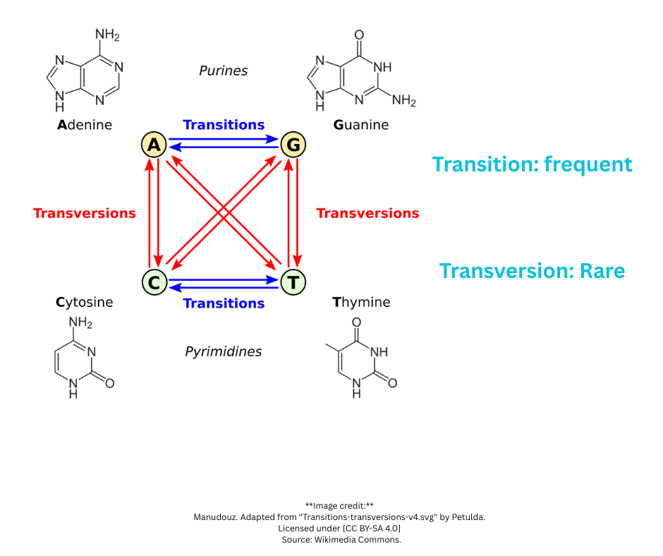
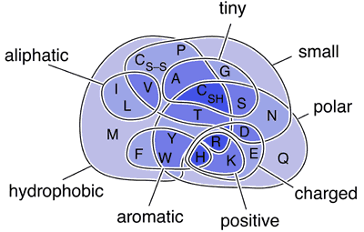

# Sequence Alignment

## Why Do We Align Sequences?

Because **similarity reveals relationships**.

If two protein or DNA sequences are similar, they likely:
- **Share a common ancestor** (homology)
- **Have similar functions** (we can transfer annotations)
- **Adopt similar structures** (especially for proteins)

**The core idea:** Evolution preserves what works. Similar sequences suggest shared evolutionary history, which means shared function and structure.

**Practical applications:**
- Predict function of unknown proteins (find similar, well-studied proteins)
- Identify conserved regions (important for function)
- Build phylogenetic trees (understand evolutionary relationships)
- Find functional domains (recurring patterns across proteins)
- Detect mutations and variants (compare to reference sequences)

**Without alignment,** we can't quantify similarity. Alignment gives us a systematic way to compare sequences and measure their relatedness.

## Pairwise Sequence Alignment

The basic scenario in bioinformatics:
- You have a **sequence of interest** (newly discovered, unknown function)
- You have a **known sequence** (well-studied, annotated)
- **Question:** Are they similar?
- **Hypothesis:** If similar, they might share function/structure

### Sequence Identity

**Sequence identity** is the percentage of exact matches between aligned sequences.

Example:
```
Seq1: ACGTACGT
Seq2: ACGTCCGT
      ||||.|||
Identity: 7/8 = 87.5%
```

But identity alone doesn't tell the whole story - we need to consider **biological similarity** (similar but not identical amino acids).

---

## Two Types of Sequence Alignment

### Global Alignment

**Goal:** Align **every residue** in both sequences from start to end.

**Residue** = individual unit in a sequence:
- For DNA/RNA: nucleotide (A, C, G, T/U)
- For proteins: amino acid

**How it works:**
- Start sequences at the same position
- Optimize alignment by inserting gaps where needed
- Forces alignment of entire sequences

**Example (ASCII):**
```
Seq1: ACGTACGT----
      |||| |||
Seq2: ACGTTACGTAGC
```

**Best for:** Sequences of similar length that are expected to be similar along their entire length.

### Local Alignment

**Goal:** Find the **most similar regions** between sequences, ignoring less similar parts.

**How it works:**
- Identify regions of high similarity
- Ignore dissimilar terminals and regions
- Can find multiple local alignments in the same pair

**Example (ASCII):**
```
Seq1:        GTACGT
             ||||||
Seq2: AAAAGTGTACGTCCCC
```

Only the middle region is aligned; terminals are ignored.

**Best for:** 
- Short sequence vs. longer sequence
- Distantly related sequences
- Finding conserved domains in otherwise divergent proteins

---

## Scoring Alignments

Because there are **many possible ways** to align two sequences, we need a **scoring function** to assess alignment quality.

### Simple Scoring: Percent Match

**Basic approach:** Count matches and calculate percentage.

```
Seq1: ACGTACGT
      |||| |||
Seq2: ACGTTCGT

Matches: 7/8 = 87.5%
```

**Problem:** This treats all mismatches equally. But some substitutions are more biologically likely than others.

---

## Additive Scoring with Linear Gap Penalty

**Better approach:** Assign scores to matches, mismatches, and gaps.

**Simple scoring scheme:**
- **Match (SIM):** +1
- **Mismatch:** -1
- **Gap penalty (GAP):** -1

**Formula:**
```
Score = Σ[SIM(s1[pos], s2[pos])] + (gap_positions × GAP)
```

**Example:**
```
Seq1: ACGT-ACGT
      |||| ||||
Seq2: ACGTTACGT

Matches: 8 × (+1) = +8
Gap: 1 × (-1) = -1
Total Score = +7
```

---

## Affine Gap Penalty: A Better Model

**Problem with linear gap penalty:** Five gaps in one place vs. five gaps in different places - which is more biologically realistic?

**Answer:** Consecutive gaps (one insertion/deletion event) are more likely than multiple separate events.

**Affine gap penalty:**
- **GOP (Gap Opening Penalty):** Cost to START a gap (e.g., -5)
- **GEP (Gap Extension Penalty):** Cost to EXTEND an existing gap (e.g., -1)

**Formula:**
```
Score = Σ[SIM(s1[pos], s2[pos])] + (number_of_gaps × GOP) + (total_gap_length × GEP)
```

**Example:**
```
One gap of length 3: GOP + (3 × GEP) = -5 + (3 × -1) = -8
Three gaps of length 1: 3 × (GOP + GEP) = 3 × (-5 + -1) = -18
```

**Consecutive gaps are penalized less** - matches biological reality better.

---

## DNA vs. Protein Level Alignment

### The Problem

Consider these DNA sequences:
```
DNA1: CAC
DNA2: CAT
      ||.
```

At the DNA level: C matches C, A matches A, but C doesn't match T (67% identity).

**But translate to protein:**
```
CAC → Histidine (His)
CAT → Histidine (His)
```

**Both code for the same amino acid!** At the protein level, they're 100% identical.

### Which Level to Use?

**DNA alignment:**
- More sensitive to recent changes
- Can detect synonymous mutations
- Good for closely related sequences

**Protein alignment:**
- Captures functional conservation
- More robust for distant relationships
- Ignores silent mutations

**Rule of thumb:** For evolutionary distant sequences, protein alignment is more informative because the genetic code is redundant - multiple codons can encode the same amino acid.

---

## Substitution Matrices: Beyond Simple Scoring

### The DNA Problem: Not All Mutations Are Equal

<div style="text-align: center;">
  
</div>

**Transitions** (purine ↔ purine or pyrimidine ↔ pyrimidine):
- A ↔ G
- C ↔ T
- **More common** in evolution

**Transversions** (purine ↔ pyrimidine):
- A/G ↔ C/T
- **Less common** (different ring structures)

**Implication:** Not all mismatches should have the same penalty. A transition should be penalized less than a transversion.

### The Protein Problem: Chemical Similarity

<div style="text-align: center;">
  
</div>

Amino acids have different chemical properties:
- Hydrophobic vs. hydrophilic
- Charged vs. neutral
- Small vs. large
- Aromatic vs. aliphatic

**Key insight:** Substitutions between **chemically similar** amino acids (same set in the diagram) occur with **higher probability** in evolution.

Example:
- Leucine (Leu) → Isoleucine (Ile): Both hydrophobic, similar size → common
- Leucine (Leu) → Aspartic acid (Asp): Hydrophobic → charged → rare

**Problem:** Venn diagrams aren't computer-friendly. We need numbers.

**Solution:** Substitution matrices.

---

## PAM Matrices (Point Accepted Mutation)

<div style="text-align: center;">
  
  <p><em>Image © Anthony S. Serianni. Used under fair use for educational purposes.<br>
  Source: <a href="https://www3.nd.edu/~aseriann/CHAP7B.html/sld017.htm">https://www3.nd.edu/~aseriann/CHAP7B.html/sld017.htm</a></em></p>
</div>

PAM matrices encode the probability of amino acid substitutions.

**How to read the matrix:**
- This is a **symmetric matrix** (half shown, diagonal contains self-matches)
- **Diagonal values** (e.g., Cys-Cys = 12): Score for matching the same amino acid
- **Off-diagonal values**: Score for substituting one amino acid for another

**Examples from PAM250:**
- **Cys ↔ Cys:** +12 (perfect match, high score)
- **Pro ↔ Leu:** -3 (not very similar, small penalty)
- **Pro ↔ Trp:** -6 (very different, larger penalty)

**Key principle:** Similar amino acids (chemically) have **higher substitution probabilities** and therefore **higher scores** in the matrix.

### What Does PAM250 Mean?

**PAM = Point Accepted Mutation**

**PAM1:** 1% of amino acids have been substituted (very similar sequences)  
**PAM250:** Extrapolated to 250 PAMs (very distant sequences)

**Higher PAM number = more evolutionary distance = use for distantly related proteins**

---

## BLOSUM Matrices (BLOcks SUbstitution Matrix)

**BLOSUM** is another family of substitution matrices, built differently from PAM.

### How BLOSUM is Built

**Block database:** Collections of ungapped, aligned sequences from related proteins.

Amino acids in the blocks are grouped by **chemistry of the side chain** (like in the Venn diagram).

**Each value in the matrix** is calculated by:
```
Frequency of (amino acid pair in database)
÷
Frequency expected by chance
```

Then converted to a log-odds score.

### Interpreting BLOSUM Scores

**Zero score:**  
Amino acid pair occurs **as often as expected by random chance**.

**Positive score:**  
Amino acid pair occurs **more often than by chance** (conserved substitution).

**Negative score:**  
Amino acid pair occurs **less often than by chance** (rare/unfavorable substitution).

### BLOSUM Naming: The Percentage

**BLOSUM62:** Matrix built from blocks with **no more than 62% similarity**.

**What this means:**
- BLOSUM62: Mid-range, general purpose
- BLOSUM80: More related proteins (higher % identity)
- BLOSUM45: Distantly related proteins (lower % identity)

**Note:** Higher number = MORE similar sequences used to build matrix.

### Which BLOSUM to Use?

**Depends on how related you think your sequences are:**

**Comparing two cow proteins?**  
Use **BLOSUM80** (closely related species, expect high similarity)

**Comparing human protein to bacteria?**  
Use **BLOSUM45** (distantly related, expect low similarity)

**Don't know how related they are?**  
Use **BLOSUM62** (default, works well for most cases)

---

## PAM vs. BLOSUM: Summary

| Feature | PAM | BLOSUM |
|---------|-----|--------|
| **Based on** | Evolutionary model (extrapolated mutations) | Observed alignments (block database) |
| **Numbers mean** | Evolutionary distance (PAM units) | % similarity of sequences used |
| **Higher number** | More distant sequences | More similar sequences (opposite!) |
| **PAM250 ≈** | BLOSUM45 | (both for distant proteins) |
| **PAM100 ≈** | BLOSUM80 | (both for close proteins) |
| **Most common** | PAM250 | BLOSUM62 |

**Key difference in naming:**
- **PAM:** Higher number = MORE evolutionary distance
- **BLOSUM:** Higher number = LESS evolutionary distance (MORE similar sequences)

**Which to use?**
- **BLOSUM** is more commonly used today (especially BLOSUM62)
- **PAM** is more theoretically grounded but less practical
- For most purposes: **Start with BLOSUM62**


